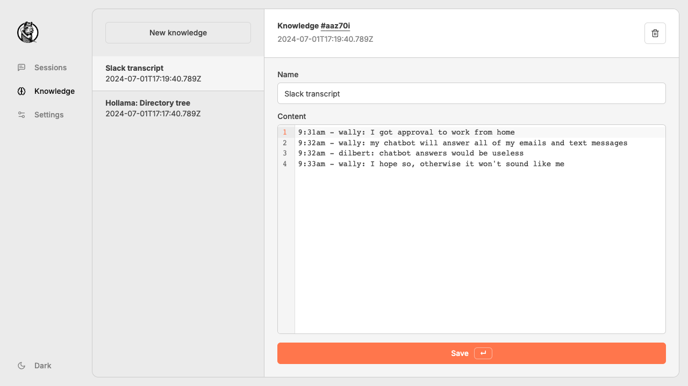

# Hollama

A minimal web-UI for talking to [Ollama](https://github.com/jmorganca/ollama/) servers.

### Features

- Large prompt fields
- Streams completions
- Copy completions as raw text
- Markdown parsing w/syntax highlighting
- Prompt text-boxes with code editor features
- _"Knowledge"_ lets you add context to sessions
- Saves all changes on your browser's `localStorage`

> 
> 
> 
> 

## How to use?

### Live demo

[!TIP]
The latest version of **Hollama** is available at [https://hollama.fernando.is](https://hollama.fernando.is).

No sign up is required and data is _100% stored locally on your browser_.

### Docker image

Run the command below, then visit [http://localhost:4173](http://localhost:4173).

```shell
docker run --rm -d -p 4173:4173 ghcr.io/fmaclen/hollama:latest 
```

### Connecting to an Ollama server

If you are using the publicly hosted version or your Docker server is on a separate device than the Ollama server you'll have to set the domain in `OLLAMA_ORIGINS`. [Learn more in Ollama's docs](https://github.com/ollama/ollama/blob/main/docs/faq.md#how-do-i-configure-ollama-server).

```bash
OLLAMA_ORIGINS=https://hollama.fernando.is ollama serve
```

## Developing

Install dependencies with `npm install`, start a development server:

```bash
npm run dev

# or start the server and open the app in a new browser tab
npm run dev -- --open
```

## Building

To create a production version of your app:

```bash
npm run build
```

You can preview the production build with `npm run preview`.
