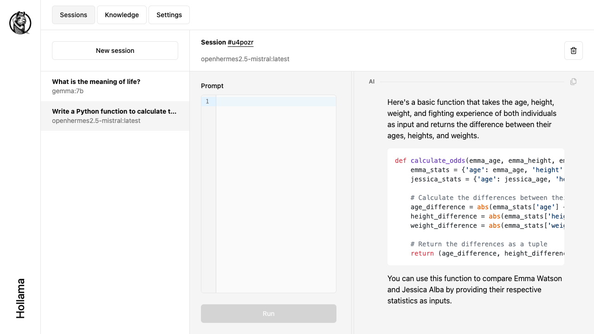
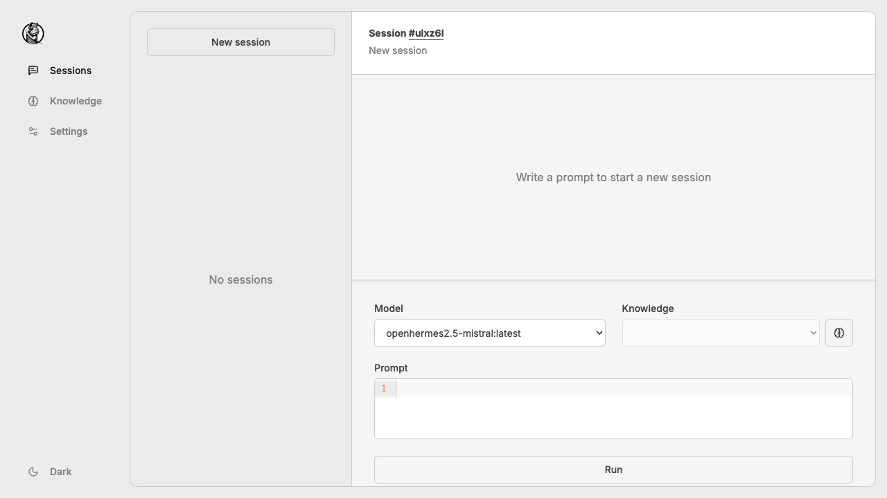
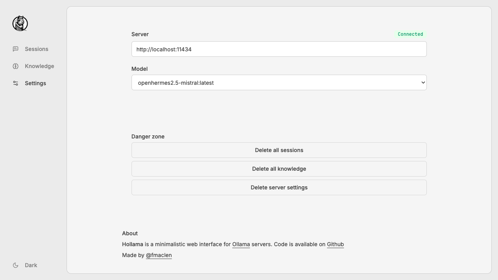

# Hollama

A minimal web-UI for talking to [Ollama](https://github.com/jmorganca/ollama/) servers.

> 
> 
> 


### Features

- Large prompt fields
- Streams completions
- Copy completions as raw text
- Markdown parsing w/syntax highlighting
- Saves sessions/context in your browser's `localStorage`

## How to use?

### Publicly hosted

The latest version of **Hollama** is available at [https://hollama.fernando.is](https://hollama.fernando.is).
No sign up is required and data is _100% stored locally on your browser_.

### Docker image

Run the command below, then visit [http://localhost:4173](http://localhost:4173).

```shell
docker run --rm -d -p 4173:4173 ghcr.io/fmaclen/hollama:latest 
```

### Connecting to an Ollama server

If you are using the publicly hosted version or your Docker server is on a separate device than the Ollama server you'll have to update your Ollama `ORIGIN` settings. Follow the instructions in the Hollama server setup window to learn more.

## Developing

Create a copy `.env.example`, update the values and save it as `.env`. 

Once you've created a project and installed dependencies with `npm install` (or `pnpm install` or `yarn`), start a development server:

```bash
npm run dev

# or start the server and open the app in a new browser tab
npm run dev -- --open
```

## Building

To create a production version of your app:

```bash
npm run build
```

You can preview the production build with `npm run preview`.

> To deploy your app, you may need to install an [adapter](https://kit.svelte.dev/docs/adapters) for your target environment.
