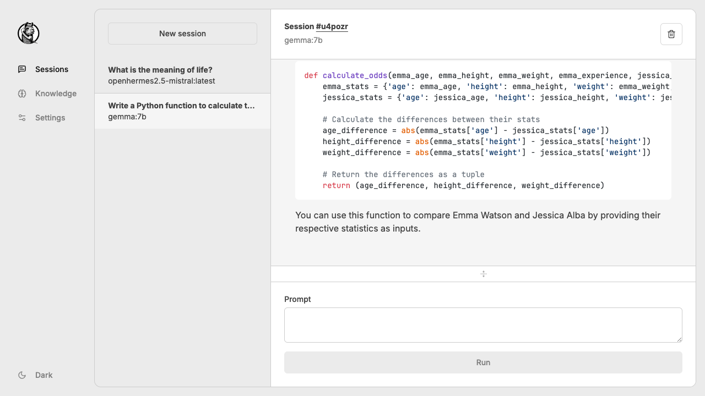
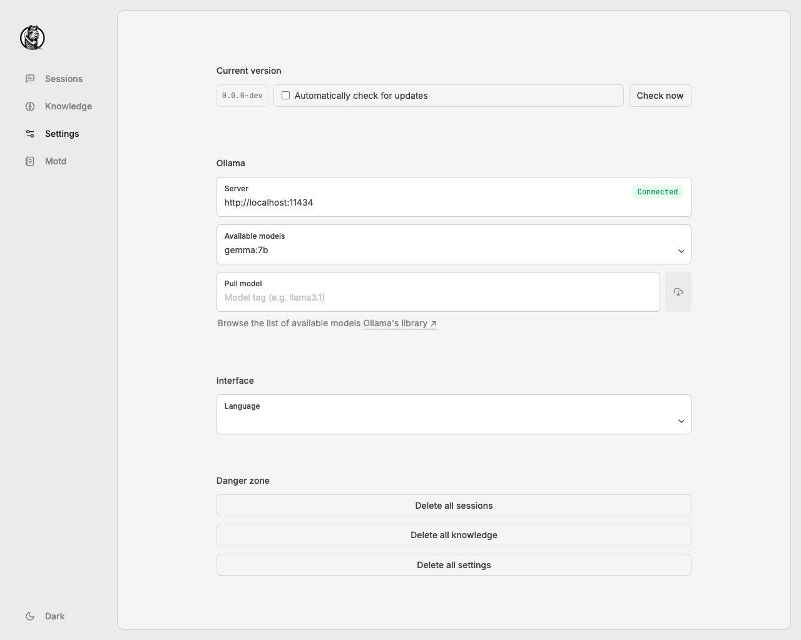
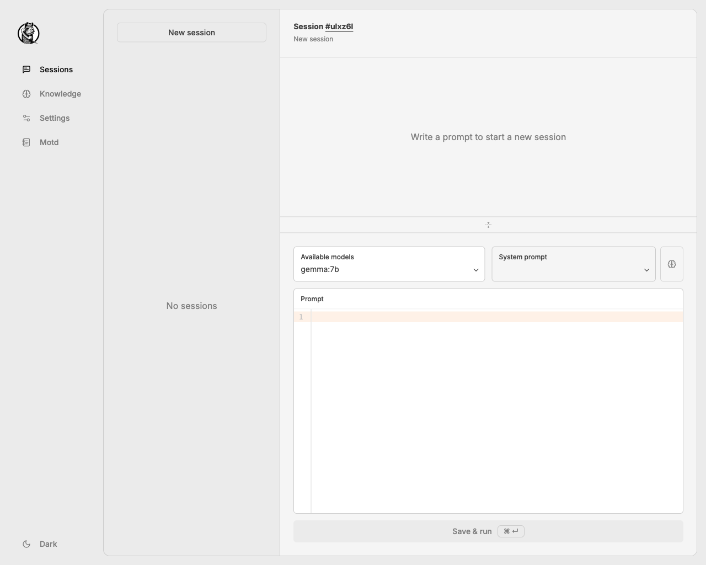
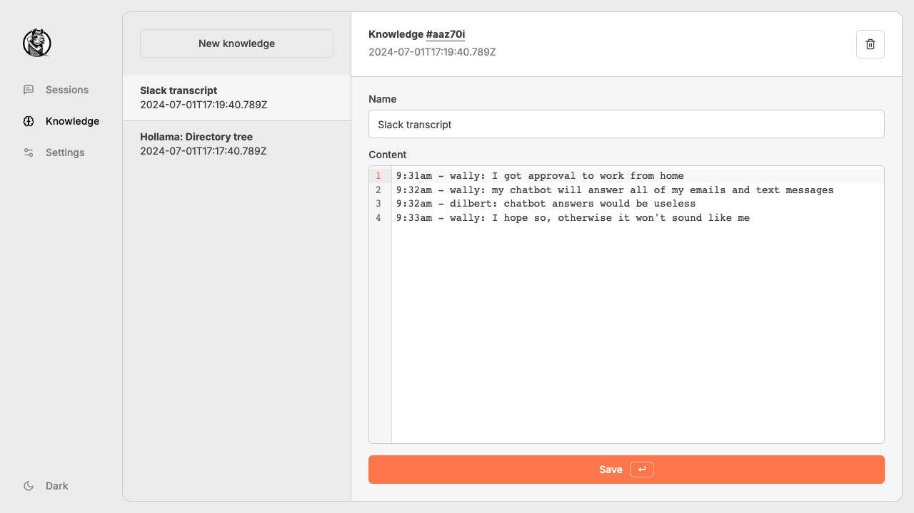

# Hollama "Spark"

A minimal LLM chat app that runs _entirely_ in your browser. The "Spark" fork intends to target newer open-weights models such as [Gemma 4](https://huggingface.co/collections/google/gemma-4). The priority is building tools that assist _my_ needs, but I'm willing to share.

## Fork To-Dos

- M**ake local llama.cpp a first-class citizen.**
- Streamline support for llama-swap - seamless multi-model via a single llama-server instance.
- Add some nice-to-haves (in-line thinking toggle, AI-generated chat titles, etc).
- Write a companion script (bash/powershell/python) for managing llama-server and model downloads (from HuggingFace).
- Add web-compatible tools that models like Gemma 4 and Nemotron 3 can leverage (fetch, websearch, etc).
- Allow a chat to spawn sub-agents with their own unique prompts.
- Support loading multiple models via multiple llama-server instances at once.
- Support cross-chat communication for agent swarm workflows (i.e. Gemma and Nemotron collaboration).
- _stretch:_ Build a llama-server proxy API for local ops (i.e. local file read/write).
- _stretch:_ Teach in-line file updates (grep on keywords, read line chunks around keywords, modify file by those chunks only).
- _stretch:_ Long-term chat history via vector embeddings and a recall tool.

## Features

- Support for **Ollama** & **OpenAI** servers
- Multi-server support
- Text & vision models
- Large prompt fields
- Support for reasoning models
- Markdown rendering with syntax highlighting
- KaTeX math notation
- Code editor features
- Customizable system prompts & advanced Ollama parameters
- Copy code snippets, messages or entire sessions
- Edit & retry messages
- Stores data locally on your browser
- Import & export stored data
- Responsive layout
- Light & dark themes
- Multi-language interface
- Download [Ollama models](https://ollama.ai/models) directly from the UI

## Get started

- ⚡️ [Live demo](https://hollama.fernando.is)
  - _No sign-up required_
- 🖥️ Download for [macOS, Windows & Linux](https://github.com/fmaclen/hollama/releases)
- 🐳 [Self-hosting](SELF_HOSTING.md) with Docker
- 🐞 [Contribute](CONTRIBUTING.md)

|          |    |
| ------------------------------------------------------------ | -------------------------------------------------------- |
|  |  |
